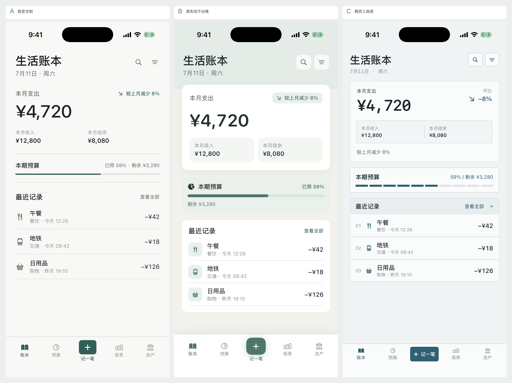

# Main Interface Visual Exploration

## 比较基线

主界面三版使用相同的信息与功能：生活账本、当前日期、本月支出 ¥4,720、较上月减少 8%、本月收入 ¥12,800、本月结余 ¥8,080、本期预算已用 59%、三条最近记录、搜索、筛选，以及相同的五项底部 Tab 栏。

“记一笔”只出现在主界面底部 Tab 栏中央，作为全局高频快捷入口。预算页的操作已经调整为“调整预算”和“查看明细”。

## 方向 A：极度克制

1. **设计理念**：将主界面视为一本安静的即时账簿，先显示本月支出，再依次显示收入结余、预算状态和最近记录。
2. **色彩方案**：沿用暖白背景、深墨文字和低饱和深绿单一强调色。
3. **字体层级**：30 pt 页面标题、43 pt 核心金额，正文与标签通过字重和灰度区分。
4. **间距体系**：24 pt 页面边距，19–31 pt 区块间距，列表行保持 13 pt 垂直留白。
5. **圆角和边框**：内容不使用圆角容器，仅中央快捷入口使用 7 pt 圆角；区块用 1 px 分割线组织。
6. **卡片、按钮、列表**：无内容卡片；搜索与筛选为低权重图标；交易列表直接位于背景上。
7. **优点**：阅读路径最直接、噪音最低，底部导航与内容不会竞争注意力。
8. **可能问题**：大屏或记录较少时留白明显；复杂状态需要非常谨慎地加入。
9. **适合原因**：高频打开主界面时，能最快读到支出结论并开始记账。
10. **底部 Tab 栏**：纯色平面与顶部细分割线；中央“记一笔”适度强化但不悬浮发光。

## 方向 B：柔和但不幼稚

1. **设计理念**：用暖灰环境层与少量柔和表面降低财务信息的压力感，同时维持清晰的主次顺序。
2. **色彩方案**：暖灰背景、浅绿顶部环境层、白色表面与低饱和绿强调色。
3. **字体层级**：29 pt 圆体页面标题、42 pt 圆体核心金额；普通信息仍使用原生正文体系。
4. **间距体系**：18 pt 页面边距，16 pt 区块间距，卡片内部使用 12–20 pt。
5. **圆角和边框**：主摘要 16 pt、预算状态 13 pt、列表 15 pt；只在主摘要和底栏使用极轻阴影。
6. **卡片、按钮、列表**：摘要与交易列表各一个单层卡片，预算状态独立成柔和横条；图标使用小型浅色底。
7. **优点**：亲和、易懂，搜索、筛选和主操作的可点击感最明确。
8. **可能问题**：容器数量最多，推广时必须限制卡片层级和阴影使用。
9. **适合原因**：适合面向更广泛的个人用户，既不像办公工具，也不会显得年轻化或廉价。
10. **底部 Tab 栏**：白色实体栏，中央入口为柔和方圆按钮；仅一次轻微层级阴影。

## 方向 C：精密工具感

1. **设计理念**：将月度金额、预算进度和交易记录组织为清晰的数据模块，强调可靠与可扫描性。
2. **色彩方案**：冷灰背景、近白表面、深青蓝单一强调色与中性结构线。
3. **字体层级**：27 pt 页面标题、38 pt 等宽核心金额，数字与百分比统一使用等宽字形。
4. **间距体系**：18 pt 页面边距，14 pt 区块间距，面板内部使用 10–17 pt。
5. **圆角和边框**：统一 5–6 pt 小圆角和 1 px 边框，不使用阴影。
6. **卡片、按钮、列表**：摘要、预算和列表各为单层边框模块；交易行增加低权重序号，预算使用十段刻度。
7. **优点**：数字关系最明确，适合未来扩展更多筛选、对比与资产信息。
8. **可能问题**：结构边界较多；若其他页面照搬同等强度，会逐渐接近后台工具。
9. **适合原因**：能强化财务产品的可信度，同时仍保持单列原生移动端阅读顺序。
10. **底部 Tab 栏**：顶部明确分割线，中央“记一笔”使用紧凑矩形强调，不增加额外文案。

## 运行方式

- 主界面探索：Debug 启动参数加入 `-visualHomeExploration`。
- 固定方向：再加入 `-visualDirectionA`、`-visualDirectionB` 或 `-visualDirectionC`。
- 干净截图：再加入 `-visualDirectionSnapshot`。

当前仍是固定数据的隔离视觉探索，没有替换正式账本主界面，也没有修改正式底部 Tab 栏。
