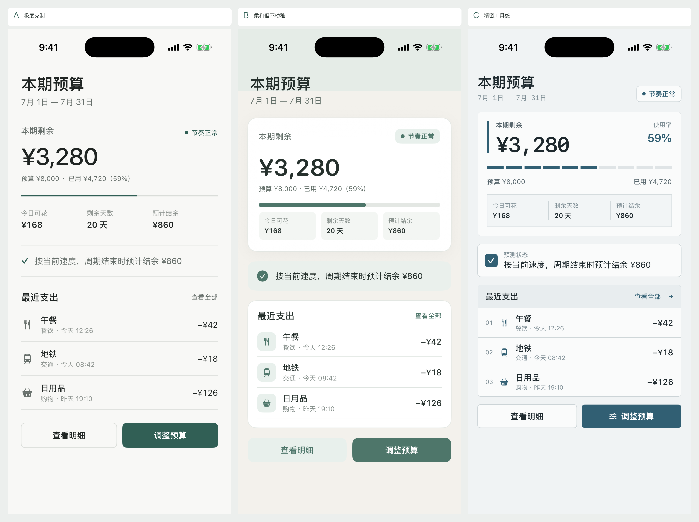

# Visual Direction Exploration

## 代表页面与比较基线

本轮选择“本期预算”作为代表页面。它能在同一屏内同时覆盖页面标题、核心金额、普通指标、主操作、次要操作、状态反馈与最近支出列表，适合检验视觉层级是否清晰，也与 FlashCount 的核心记账场景直接相关。

三个方向严格复用同一组固定演示内容：本期剩余 ¥3,280、预算 ¥8,000、已用 ¥4,720（59%）、今日可花 ¥168、剩余 20 天、预计结余 ¥860，以及完全相同的三条最近支出。演示页不读取或写入 SwiftData，因此不会影响真实账目与预算。

## 方向 A：极度克制

1. **设计理念**：取消传统英雄卡片，以页面留白、文字尺度、对齐和细分割线构建信息层级。强调“先读结论，再读依据”，不使用装饰性图形。
2. **色彩方案**：背景 `#F8F8F6`，主文字 `#202523`，次文字 `#68706C`，弱文字 `#929894`，分割线 `#DADDD9`，唯一强调色为低饱和深绿 `#315F55`。
3. **字体层级**：页面标题 30/semibold；核心金额 43/medium/等宽数字；区块标题 headline/semibold；正文 subheadline；标签 caption。金额不使用圆体，保持清醒、稳定。
4. **间距体系**：以 4 pt 为基准，主要使用 6、10、13、19、23、24、28、34 pt。区块间距明显大于行内间距，用距离替代容器。
5. **圆角和边框规则**：仅按钮使用 7 pt 圆角；内容区域不设圆角。边界统一使用 1 px 中性分割线，进度条为 3 px 直线。
6. **卡片、按钮、列表**：不使用内容卡片；“调整预算”为深绿实底主按钮，“查看明细”为白底细描边次按钮；列表直接落在页面背景上，行间用分割线结束。
7. **优点**：信息权重最清楚，视觉噪音最低，长期使用不易疲劳；核心金额和预算节奏能在进入页面后立即被识别。
8. **可能问题**：对排版与内容质量依赖最高；内容继续增多时，需要更严格的分组规则，否则页面可能显得过于平坦。
9. **适合本 App 的原因**：记账是高频、短停留任务，这个方向把阅读速度和操作效率置于装饰之前，同时仍通过精细对齐避免默认组件拼装感。
10. **可运行页面**：Debug 启动参数使用 `-visualDirectionExploration -visualDirectionA`；不加截图参数时可在底部切换 A/B/C。

## 方向 B：柔和但不幼稚

1. **设计理念**：用暖灰底色、低对比表面和柔和绿建立亲和感，但维持明确的信息顺序与成年化的中性色，不使用渐变、发光或玻璃拟态。
2. **色彩方案**：背景 `#F3F1EC`，顶部环境层 `#E5ECE7`，卡片 `#FFFFFF`，柔和状态面 `#E8F0EC`，主文字 `#26312D`，强调色 `#4E766A`。
3. **字体层级**：页面标题 29/semibold/rounded；核心金额 42/semibold/rounded/等宽数字；区块标题 headline；正文 subheadline；辅助信息 caption。圆体只用于大标题和金额，不扩散到全部文本。
4. **间距体系**：以 4 pt 为基准，主要使用 5、8、10、15、18、20、24 pt。卡片内部密度适中，卡片之间固定 18 pt。
5. **圆角和边框规则**：主摘要 16 pt、普通列表 15 pt、状态块 13 pt、指标块与按钮 10–11 pt；全部保持在适中范围。卡片使用 1 px 低对比边框，仅主摘要有一次极轻阴影。
6. **卡片、按钮、列表**：摘要与最近支出各使用一个单层卡片，状态为独立柔和背景块；“调整预算”为强调色实底主按钮，“查看明细”使用浅绿次级表面；列表图标以小型方圆底承载。
7. **优点**：比 A 更亲切，状态和可操作区域更容易被非专业用户理解；暖灰底与低饱和绿能减少“办公软件感”。
8. **可能问题**：容器数量比 A 多，若推广时缺少限制，容易重新滑向卡片化；浅色表面在强光环境中需要继续检查对比度。
9. **适合本 App 的原因**：个人财务既需要稳定感，也涉及一定情绪压力；柔和表面能降低压迫感，同时保留清晰的金额层级与主操作。
10. **可运行页面**：Debug 启动参数使用 `-visualDirectionExploration -visualDirectionB`。

## 方向 C：精密工具感

1. **设计理念**：用明确的边界、紧凑网格、等宽数字和分段进度建立可靠的工具感；避免表格化与控制台化，页面仍围绕一个核心结论组织。
2. **色彩方案**：背景 `#F0F3F4`，表面 `#FAFBFB`，主文字 `#1E292E`，次文字 `#56656C`，结构线 `#CCD4D7`，唯一强调色为深青蓝 `#315F73`。
3. **字体层级**：页面标题 27/semibold；核心金额 38/semibold/monospaced；重要百分比 title3；区块标题 subheadline/semibold；标签 caption/caption2，数字尽量采用等宽字形。
4. **间距体系**：以 4 pt 为基准，主要使用 4、9、11、13、14、17、18、22 pt。纵向区块间距压缩到 14 pt，内部依靠网格对齐维持可读性。
5. **圆角和边框规则**：统一 5–6 pt 小圆角；所有结构边界为 1 px 中性线，状态图标 4 pt 圆角。无阴影。
6. **卡片、按钮、列表**：摘要、状态和列表采用清晰单层边框面板；进度改为十段式刻度；列表增加低权重序号和统一金额列；“调整预算”为青蓝实底主按钮，“查看明细”为描边次按钮。
7. **优点**：数据关系和边界最明确，信息密度最高但仍容易扫描；对数字变化、状态比较和未来扩展更多指标最友好。
8. **可能问题**：冷色和高结构感更接近专业工具；如果所有页面都使用同等强度的边界，会变得机械或像后台系统。
9. **适合本 App 的原因**：预算与资产本质上是数据工具，这个方向能提升可信度和精确感；通过单列结构、单一强调色和较大的核心金额，避免退化成企业报表。
10. **可运行页面**：Debug 启动参数使用 `-visualDirectionExploration -visualDirectionC`。

## 运行与截图

- 交互探索：在 Debug Scheme 的 Arguments Passed On Launch 中加入 `-visualDirectionExploration`，页面底部会显示 A/B/C 切换器。
- 固定方向截图：再加入 `-visualDirectionSnapshot` 和 `-visualDirectionA`、`-visualDirectionB` 或 `-visualDirectionC`，切换器会隐藏。
- 三张原始截图与并排图位于 `docs/visual-direction-screenshots/`。

当前阶段的限制：仅验证 iPhone 17 Pro 的浅色模式与默认动态字体尺寸；演示按钮只显示“不写入数据”的反馈；尚未把任何方向应用到正式预算页或其他页面。
